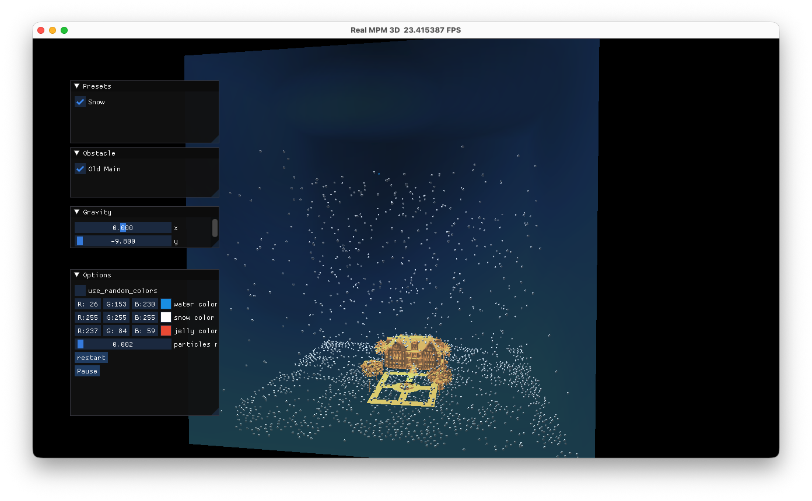

# AME-EEE-598-Taichi-MPM

## Dependencies

```bash
conda create -n taichi python=3.13.12
conda activate taichi
pip install -r requirements.txt
```

## Snowfall particles



```bash
python src/snowfall_particles/snowfall_simulate.py --config configs/default.yml
python src/snowfall_particles/snowfall_simulate.py --offline --config configs/fine_grid_snow.yml --output outputs/snow.npz
python src/snowfall_particles/visualize_output.py outputs/snow.npz
```

- Default settings are in [`configs/default.yml`](configs/default.yml), you can edit `n_grid` / `steps` / `dt` / `n_particles`, gravity, rendering options, obstacle lists, and more there
- Grid SDF cache enabled: same directory as the mesh file (alongside the mesh), naming `cache_<mesh_filename>.sdf_res<res>.<key>.npz`, derived from mesh content SHA256 together with `(sdf_res, scale, center)`; a new file is created when content or parameters change.
- Offline mode will save the particle positions to an .npz file for future rendering. The data size of 2000 particles for 2 seconds is about 14 MB.

### TODO 

- [x] Add random wind force
- [x] Add max velocity limit


## Walking tree controller

```bash
python src/walking_tree_controller/diffmpm3d.py --iters 0 --export_init_ply outputs/walking_tree_init.ply
python src/walking_tree_controller/diffmpm3d.py
python src/walking_tree_controller/visualize_output.py outputs/mpm3d/iter0019
```

## Skeleton to tree-shaped mesh
