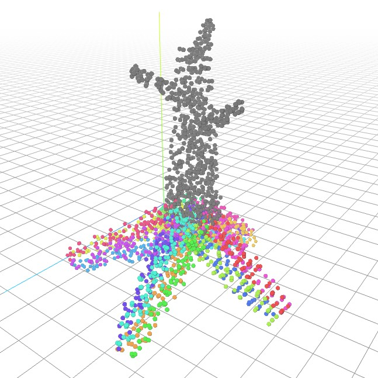
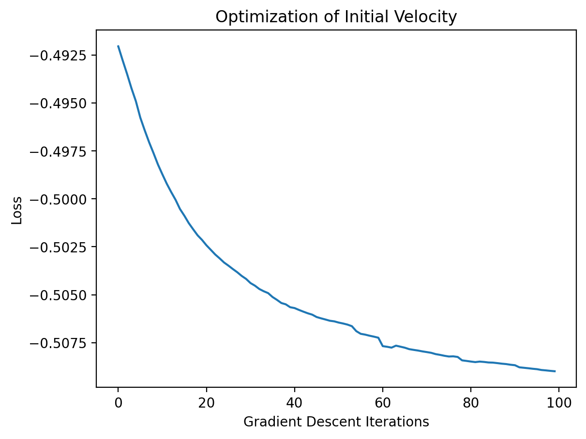

# AME-EEE-598-Taichi-MPM

## Dependencies

```bash
conda create -n taichi python=3.13.12
conda activate taichi
pip install -r requirements.txt
```

## Snowfall particles

- Motivation: simulate visually plausible snowfall with Taichi MPM, including wind, particle respawn, and collision against scene geometry.

https://github.com/user-attachments/assets/5ec39908-b7f0-442d-996e-5f0f4811104c

```bash

python src/snowfall_particles/snowfall_simulate.py --config configs/default.yml
python src/snowfall_particles/snowfall_simulate.py --offline --config configs/fine_grid_snow.yml --output outputs/snow.npz
python src/snowfall_particles/visualize_output.py outputs/snow.npz
```

- Default settings are in [`configs/default.yml`](configs/default.yml), you can edit `n_grid` / `steps` / `dt` / `n_particles`, gravity, rendering options, obstacle lists, and more there
- Grid SDF cache enabled: same directory as the mesh file (alongside the mesh), naming `cache_<mesh_filename>.sdf_res<res>.<key>.npz`, derived from mesh content SHA256 together with `(sdf_res, scale, center)`; a new file is created when content or parameters change.
- Offline mode will save the particle positions to an .npz file for future rendering. The data size of 2000 particles for 2 seconds is about 14 MB.

### TODO 

- [x] Add random wind force
- [x] Add max velocity limit
- [ ] Use a cloud of snow particles in stead of a single particle when respawning

## Walking tree controller

```bash
python src/walking_tree_controller/diffmpm3d.py --iters 0 --export_init_ply outputs/walking_tree_init.ply
python src/walking_tree_controller/diffmpm3d.py --out_dir outputs/walking_tree/ --seed 42 --dump_mesh
python src/walking_tree_controller/visualize_output.py outputs/walking_tree/iter0019_particle
python src/walking_tree_controller/visualize_output.py outputs/walking_tree/iter0019_mesh --mode mesh
```

- Motivation: create a walking tree animation by treating tree roots as a soft robotic locomotion system, and let differentiable physics (Taichi MPM) discover useful actuation patterns instead of hand-animating the roots.



- Core idea: each root is modeled as a deformable MPM body. The root is first represented by a smooth centerline curve, then particles are sampled around the curve to form soft limbs.
- Actuator design: each root is split into several segments, and each segment contains multiple actuators. Particles store local actuator directions, allowing different root sections to bend in different directions.
- Optimization: gradients flow from the final motion objective through the simulation trajectory back to the actuator control parameters. The controller uses sinusoidal basis parameters such as amplitude, phase, bias, and frequency, optimized with gradient descent to maximize forward displacement.



- Training time on Apple M4 GPU: about 120 s JIT compilation, then about 150 ms per training step for 100 steps.
- Limitation: training is sensitive to timestep, grid resolution, particle density, actuator strength, ground friction, and other simulator settings. The optimized motion may also exploit the simulator in unexpected ways.
